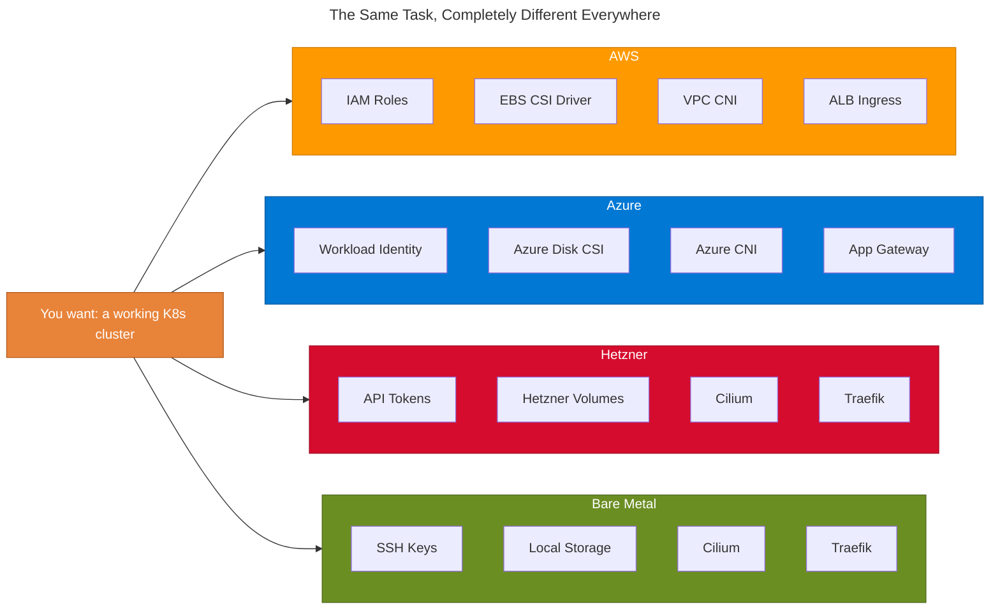
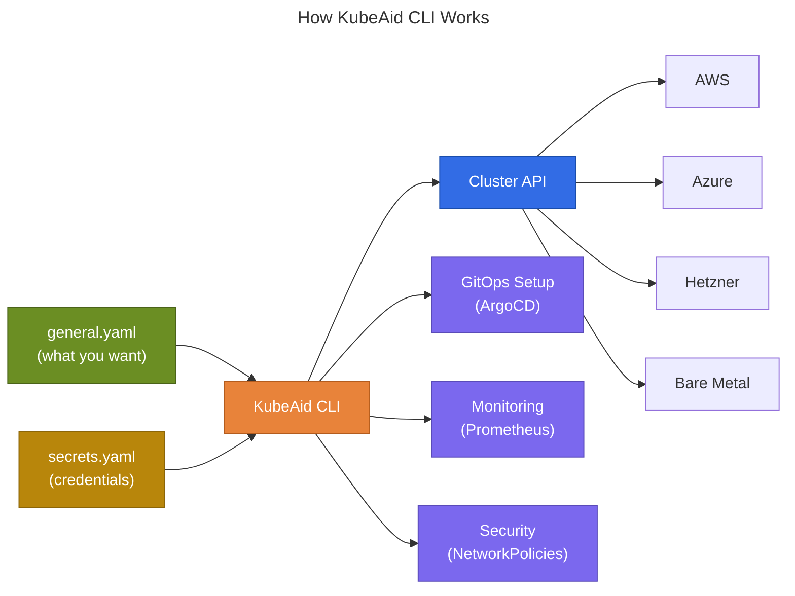
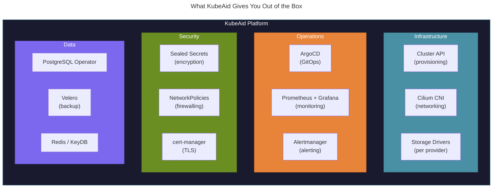
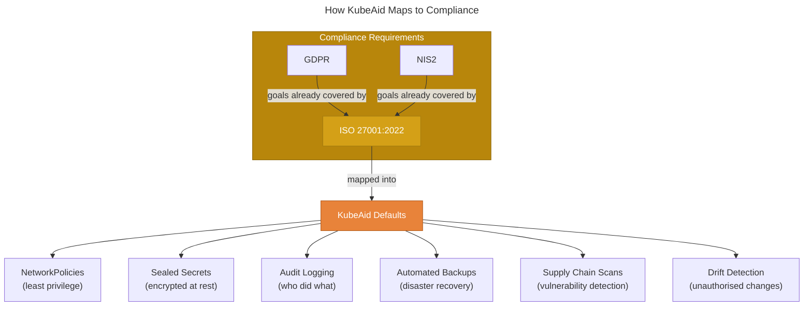

# Why KubeAid?

## The Problem: Kubernetes Is Not the Same Everywhere

Everyone thinks installing Kubernetes on any cloud is easy, at least the first time. But there is one important
distinction that most people miss: **it is very different everywhere**, especially when you need automation. And we all
need automation.

- **AWS** has its IAM system for identity management.
- **Azure** has Workload Identity to solve something similar, but in a completely different way.
- **Hetzner**, **bare metal**, and **on-premise** setups each have their own unique requirements.

Best practices for each cloud provider differ *dramatically*. The networking, the identity model, the storage, the
scaling: none of it is portable. And this is **just installation**. Day 2 operations (upgrades, monitoring, backup,
security) are even more fragmented.

The result? Every team solves the same problems from scratch, often making the same mistakes. 95% of what one team needs
is the *exact same* as what every other team needs.

---

## One Way to Install, On Any Cloud (Even Your Own)

KubeAid was designed to solve this by giving you **one unified way to install Kubernetes**, regardless of where you
choose to run it: AWS, Azure, Hetzner, bare metal, or your own data centre.

We tried hard not to reinvent the wheel. For unifying installation automation across every possible target, there is
only one solution: **[Cluster API](https://cluster-api.sigs.k8s.io/)**.

Cluster API is complex by design. It hides each cloud provider's complexity behind drivers, which are often maintained
by the cloud vendors themselves. But it removes the vendor lock-in those vendors have worked so hard to build.

On top of Cluster API, there is a *lot* to set up correctly: GitOps management, identity implementation (which differs
by provider), networking, monitoring, and more. This is what **KubeAid CLI** handles for you.

You give it **2 YAML files**:

1. **`general.yaml`**: a spec of *what you want*, written in a generalised way. You can take the same file and roll
   your cluster up in any other location.
2. **`secrets.yaml`**: the credentials needed to actually do it. Store this in your password manager.

That's it. One command, and your production-ready cluster is provisioned with GitOps, monitoring, networking, and
security configured out of the box.

---

## Curated Best Practices, Not Decision Fatigue

On top of installation, there is a *lot* of work in picking "the right" solution for everything you need in a
Kubernetes cluster. There are **10+ PostgreSQL operators** (seriously). Which one fits your needs, if you even knew you
needed an operator?

In KubeAid, we constantly evaluate and ship the best-practice solution for every common need:

- **100+ pre-configured Helm charts**, tested and updated weekly
- Default values that follow security and operational best practices
- Solutions selected based on real-world production experience across many customers

Because KubeAid is open source, everyone benefits from this collective curation. You get the best start possible, and
the community continuously improves the selection.

---

## Compliance Built In, Not Bolted On

The best practices in KubeAid are designed around the compliance requirements that have emerged because everyone
actually wants a stable environment with the best possible security and reliability, to avoid being compromised by
ransomware attacks and other threats.

We map all these requirements into the **ISO 27001:2022** specification and constantly work to ensure KubeAid guides
you to solutions that adhere to those goals. This includes legislations like **GDPR** and **NIS2**, which all have goals
that are already part of ISO 27001:2022.

We have open-sourced this compliance work and continue to improve it:
**[obmondo.com/en/compliance](https://obmondo.com/en/compliance)**

Complying with these requirements makes perfect sense. They were written by experienced people based on decades of
industry knowledge. But it takes time to learn and implement, time and skill that many smaller companies simply don't
have.

---

## The Open-Source Flywheel

This is where [Obmondo](https://obmondo.com), the makers of KubeAid, bridges the gap.

As we solve problems for our customers, we solve them so they work for *all* of our customers, no matter where they have
chosen to run their servers. Every one of our customers understands that allowing us to open-source the work we do for
them is what allows us to share the workload across all of them.

**Whenever we raise the bar, everyone benefits.**

This model means:

- Fixes and improvements for one customer flow to all customers, and to the community
- The collective investment in KubeAid is far greater than any single team could afford
- You get a platform that is battle-tested across diverse production environments

[Obmondo](https://obmondo.com) offers subscriptions where we monitor your clusters and handle your alerts 24/7,
enabling your team to focus on your business, not on who is absent, on holiday, or ill. There is **zero vendor
lock-in**: any subscription can be cancelled at any time.
